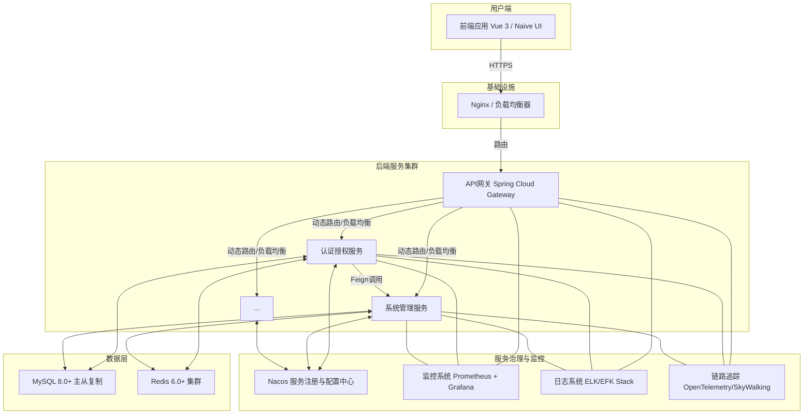
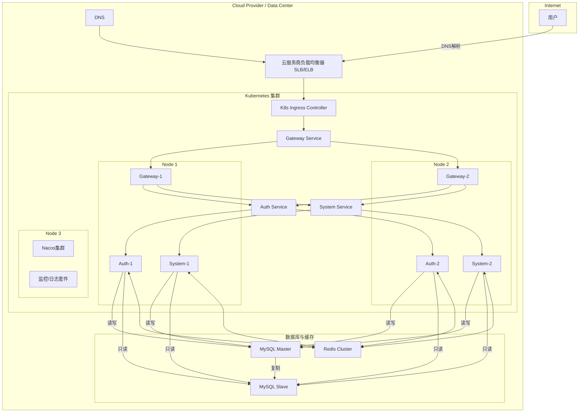
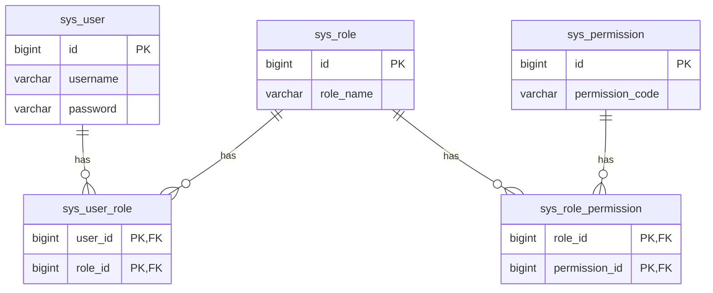
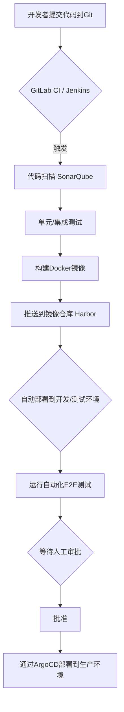

# 智语·云枢（SapientiaCloud-EduPivot）全栈架构计划书

## I. 引言

### 目的与范围

本架构计划书旨在阐明智语·云枢（SapientiaCloud-EduPivot）教育平台的全栈架构设计。作为一份综合性蓝图，本文档详细描述了系统的技术架构、组件交互、数据流转、部署策略及运维方案，为开发团队提供明确的技术指导，并确保各利益相关方对系统架构有共同、清晰的理解。

本计划书的主要目标是：

- **定义清晰的系统架构**，指导开发过程中的技术决策。
- **确保系统满足高质量属性**，如高可用性、可扩展性、安全性、可维护性和成本效益。
- **明确各层技术选型**及其交互方式。
- **规划系统的部署、监控与运维**方案。
- **提供全面的安全性设计**和测试策略。

### 架构表示

智语·云枢采用基于云原生的现代化微服务架构。系统由多个独立部署、松散耦合的服务组成，通过API网关进行统一的流量治理和安全管控。

**核心架构图：**



**核心组件说明：**

- **前端单页应用 (SPA)**：基于 `Vue 3` 和 `TypeScript` 开发，使用 `Naive UI` 组件库构建响应式用户界面。
- **API网关服务 (Gateway)**：基于 `Spring Cloud Gateway`，提供路由转发、请求过滤、负载均衡、熔断降级和安全认证等核心功能。
- **微服务集群**：
  - **认证授权服务**：基于 `Spring Security` 和 `JWT`，处理用户认证和权限管理。
  - **系统管理服务**：提供用户、角色、权限等系统基础功能。
  - **... (其他业务服务)**：未来可扩展的业务服务模块。
- **数据存储**：`MySQL` 作为主持久化数据库，`Redis` 用于高性能缓存和会话管理。
- **服务治理**：`Nacos` 作为服务注册发现和统一配置中心。
- **可观测性 (Observability)**：通过 `Prometheus`、`Grafana`、`ELK` 和 `OpenTelemetry` 构建完整的监控、日志和链路追踪体系。

## II. 架构目标与约束

### 核心目标与质量属性

1. **高可用性 (High Availability)**
   - 系统核心服务可用性目标 **99.9%**。
   - 通过微服务冗余部署和负载均衡避免单点故障。
   - 利用服务发现和熔断机制实现故障自动隔离与恢复。
2. **可扩展性 (Scalability)**
   - **水平扩展**：所有微服务均支持无状态化设计，可根据负载动态增减实例。
   - **垂直扩展**：允许在需要时为特定服务分配更多资源。
   - **数据层扩展**：数据库设计支持分库分表，以应对未来数据量的指数级增长。
3. **安全性 (Security)**
   - **纵深防御**：在网络、应用、数据等多个层面实施安全策略。
   - **认证授权**：基于 `JWT` 和 `RBAC` 的精细化权限控制。
   - **数据安全**：敏感数据加密存储，传输链路全程 `HTTPS` 加密。
   - **代码安全**：遵循安全编码规范，防范 `OWASP Top 10` 常见漏洞。
4. **可维护性 (Maintainability)**
   - **模块化架构**：清晰的模块边界，降低代码耦合度。
   - **统一规范**：强制执行统一的编码规范、API 设计规范和文档标准。
   - **可观测性**：完善的日志、监控和告警系统，支持快速定位和解决问题。
5. **性能优化 (Performance)**
   - **前端性能**：核心页面加载性能需满足 [Google Core Web Vitals](https://web.dev/vitals/) 指标（LCP < 2.5s, FID < 100ms, CLS < 0.1）。
   - **后端性能**：核心API平均响应时间控制在 **200ms** 以内，95分位响应时间低于 **500ms**。
   - **缓存策略**：广泛使用多级缓存（本地缓存、Redis）减少数据库负载。
6. **用户体验 (User Experience)**
   - **响应式设计**：自适应PC、平板和移动等多终端设备。
   - **国际化 (i18n)**：架构层面支持多语言切换。
   - **个性化**：支持主题切换（深/浅色模式）等偏好设置。
7. **成本效益 (Cost-Effectiveness)**
   - 技术选型优先考虑成熟的开源方案。
   - 资源使用按需分配，避免过度配置。

### 架构约束

1. **技术栈约束**
   - 前端：`Vue 3`, `TypeScript`, `Vite`, `Pinia`, `Naive UI`
   - 后端：`Spring Boot 3`, `Spring Cloud`, `Spring Security`
   - 数据库：`MySQL 8.0+`
   - 缓存：`Redis 6.0+`
   - 服务治理：`Nacos`
   - **强制要求**：所有新服务必须遵循此核心技术栈，任何偏离需经过架构评审。
2. **运行环境约束**
   - **部署方式**：必须通过 `Docker` 容器化部署。
   - **编排工具**：推荐使用 `Kubernetes` 或 `Docker Compose`。
   - **运行时**：`JDK 17+`, `Node.js 18+`。
3. **安全与合规约束**
   - 所有对外暴露的API必须经过API网关，并强制执行身份验证和权限校验。
   - 密码及高度敏感数据必须使用强哈希算法（如 `BCrypt`）加盐存储。
   - 系统设计需考虑数据隐私法规（如 `GDPR`）的要求。
4. **兼容性约束**
   - **浏览器**：支持主流现代浏览器（Chrome, Firefox, Safari, Edge）的最新两个版本。
   - **明确声明**：不考虑 `IE` 及其他老旧浏览器的兼容性。

## III. 架构视图

### 用例视图

系统核心用例包括：

1. **用户认证与授权**
   - 用户登录（支持账号密码、短信验证码、邮箱验证码）
   - 令牌验证与刷新
   - 权限检查与授权
2. **用户与权限管理**
   - 用户管理（创建、查询、更新、删除）
   - 角色管理（角色创建、权限分配）
   - 权限管理（权限定义与分配）
3. **个人中心**
   - 个人资料管理
   - 密码修改
   - 偏好设置（语言、主题等）

### 逻辑视图

#### 概述

系统采用经典的分层架构，各层职责分明：

1. **表示层 (Presentation Layer)**：前端UI，负责用户交互和数据展示。
2. **应用层 (Application Layer)**：后端微服务，实现核心业务逻辑。由API网关和各个业务微服务组成。
3. **数据层 (Data Layer)**：负责数据持久化（MySQL）和缓存（Redis）。
4. **支撑层 (Support Layer)**：提供服务治理、监控、日志等非功能性支持。

#### 架构重要设计包

**前端架构 (基于特性切片 Feature-Sliced Design)**：

- `src/pages`: 页面级组件，组合`widgets`和`features`。
- `src/widgets`: 独立的UI区块，如页头、侧边栏。
- `src/features`: 具有业务价值的功能，如用户登录、文章发布。
- `src/entities`: 业务实体相关的组件和状态，如用户头像、文章卡片。
- `src/shared`: 可在任何地方复用的底层UI组件、工具库、API客户端等。
- `src/app`: 应用入口、全局样式、路由和状态管理配置。

**后端架构 (各微服务内部)**：

- `api`: 对外暴露的 `Controller` 层，遵循RESTful风格。
- `service`: 核心业务逻辑实现层。
- `domain`: 领域模型，包括实体（Entity）、值对象（VO）等。
- `infrastructure`: 基础设施层，包括数据访问（Repository/Mapper）、第三方服务客户端等。
- `config`: 应用配置类。
- `common`: 公共组件，如全局异常处理、通用工具类。

### 进程视图

系统由以下主要进程（或进程组）构成：

1. **前端应用进程**：由 `Nginx` 或其他Web服务器托管的静态资源。
2. **API网关进程**：`Spring Cloud Gateway` 服务实例，作为系统统一入口。
3. **认证服务进程**：处理认证和授权的微服务实例。
4. **系统服务进程**：处理系统管理的微服务实例。
5. **数据库进程**：`MySQL` 数据库服务。
6. **缓存进程**：`Redis` 缓存服务。
7. **注册中心进程**：`Nacos` 服务。

**服务间通信**：

- **同步通信**：服务间优先通过 `OpenFeign` 客户端进行 `RESTful API` 调用。为防止级联故障，必须配置合理的超时和重试机制，并集成 `Resilience4J` 等熔断器。
- **异步通信**：对于非核心、可延迟或耗时的任务（如发送通知、记录日志），考虑引入消息队列（如 `RabbitMQ` 或 `Kafka`）进行解耦，提高系统响应能力和韧性。

### 部署视图

生产环境推荐采用基于 `Kubernetes` 的高可用部署架构。



### 数据视图

**核心实体关系 (ER Diagram):**



## IV. 前端架构

### 设计原则

前端架构设计遵循以下原则：

1. **组件化开发**：将UI拆分为可复用的独立组件
2. **状态管理集中化**：使用Pinia统一管理应用状态
3. **路由配置模块化**：基于功能模块组织路由配置
4. **API接口封装**：统一封装HTTP请求，处理错误和拦截
5. **响应式设计**：支持不同设备屏幕尺寸适配
6. **主题定制**：支持深色/浅色模式切换

### 组件化设计

在原有分类基础上，引入分层概念，增强组件职责的清晰度：

1. **通用/原子组件 (common/shared)**：无业务逻辑的纯UI组件，如按钮、输入框、图标。可使用 `Storybook` 进行独立开发和测试。
2. **业务组件 (features/entities)**：封装特定业务逻辑和数据，如登录表单、用户列表。
3. **布局组件 (layout/widgets)**：负责页面整体结构的组件，如页头、侧边栏、主内容区。
4. **容器/页面组件 (pages)**：作为页面的入口，负责组合业务组件和布局组件，处理页面级状态和逻辑。

### 状态管理

采用 `Pinia` 作为状态管理库，模块划分清晰。补充原则：

- **状态局部化**：优先使用组件内部状态。只有当状态需要在多个组件间共享，或需要跨页面持久化时，才提升到 `Pinia Store` 中。
- **数据流清晰**：严格遵守单向数据流，UI事件调用 `actions`，`actions` 修改 `state`，`state` 通过 `getters` 或直接驱动UI更新。

### 性能优化

在原有策略基础上，补充和强调：

1. **代码分割 (Code Splitting)**：利用 `Vite` 的动态导入 `import()` 实现基于路由的按需加载。
2. **Tree Shaking**：确保代码和依赖库支持并正确配置，以在生产构建中移除未使用代码。
3. **图像优化**：使用现代图像格式（如 `WebP`），并对图片进行懒加载和响应式尺寸处理。
4. **虚拟滚动 (Virtual Scrolling)**：对于长列表或表格，必须采用虚拟滚动技术以保证渲染性能。
5. **预加载/预获取 (Preload/Prefetch)**：对关键资源或用户下一步可能访问的页面进行预加载，优化用户感知性能。

### 测试策略

在原有策略基础上，增加 `Storybook` 用于组件的可视化测试和文档生成。

- **单元测试 (Unit Testing)**：使用 `Vitest` 或 `Jest` 测试 `shared` 中的工具函数和 `features/entities` 的纯逻辑部分。
- **组件测试 (Component Testing)**：测试独立组件的渲染和交互。
- **端到端测试 (E2E Testing)**：使用 `Cypress` 或 `Playwright` 模拟用户操作，测试核心业务流程。
- **可视化回归测试 (Visual Regression Testing)**：集成 `Storybook` 和相关工具，防止UI意外变更。

## V. 后端架构

### 设计模式

在原有模式基础上，补充和强调：

1. **微服务架构**
2. **API网关模式**
3. **熔断器模式 (Circuit Breaker)**：使用 `Resilience4J` 实现，防止服务雪崩，是微服务架构的必备模式。
4. **CQRS (命令查询职责分离)**：在复杂业务场景中，可考虑将读写操作分离，优化各自的性能和模型。
5. **仓储模式 (Repository)**
6. **依赖注入 (DI)**

### 单体与微服务架构权衡

系统采用了微服务架构，主要基于以下考量：

1. **优势**：
   - 服务独立部署，可单独扩展
   - 技术栈可灵活选择
   - 故障隔离，提高系统稳定性
   - 团队可并行开发，提高开发效率
2. **挑战**：
   - 增加了系统复杂性
   - 服务间通信带来额外开销
   - 需要更强的DevOps能力
   - 数据一致性要求更高

微服务拆分策略：按业务域进行拆分，目前包括认证服务和系统服务。

**微服务拆分原则补充**：

- **遵循领域驱动设计 (DDD)**：按业务边界（限界上下文）进行拆分。
- **演进式拆分**：初期可将关联紧密的业务放在一个服务中，随着业务发展再逐步拆分，避免过度设计。

### API 设计

遵循 `RESTful` 风格，并强制执行以下规范：

1. **统一响应格式**：所有API响应体必须封装在统一结构中。

   ```json
   {
     "success": true
     "code": 0, // 0表示成功，非0表示失败
     "message": "Success",
     "data": { ... } // 业务数据
   }
   ```

2. **版本控制**：在URL中加入版本号，如 `/api/v1/users`。

3. **分页**：所有返回列表的API必须支持分页，使用 `page` 和 `size` 等标准参数。

4. **错误处理**：定义清晰的全局错误码，便于客户端处理。

5. **文档**：使用 `SpringDoc` (替代Knife4j，与Spring Boot 3+ 兼容性更好) 自动生成 `OpenAPI 3.0` 文档。

### 数据库选择

系统采用MySQL作为主要数据库，同时使用Redis作为缓存。

1. **MySQL**：
   - 优势：可靠、成熟、支持复杂查询和事务
   - 使用场景：所有持久化数据存储
   - 版本：8.0+
   - 连接池：Druid
2. **Redis**：
   - 优势：高性能、支持多种数据结构、适合缓存场景
   - 使用场景：会话管理、数据缓存、分布式锁
   - 版本：6.0+
   - 客户端：Spring Data Redis

数据库设计采用规范化设计，确保数据完整性和一致性。对于高频查询，适当进行反范式化优化。

### 身份验证与授权

在原有设计基础上，强化安全细节：

1. **JWT 安全**：
   - **Token 存储**：在Web端，推荐将 `Access Token` 存储在内存中，`Refresh Token` 存储在 `HttpOnly`、`Secure`、`SameSite=Strict` 的 Cookie 中，以防范XSS攻击。
   - **Token 吊销**：实现基于 `Redis` 的黑名单机制，以支持用户登出、密码修改等场景下的 `JWT` 立即失效。
2. **授权策略**：
   - `RBAC` 模型是基础。对于更复杂的场景，可考虑引入 `ABAC` (Attribute-Based Access Control) 模型。
   - 权限数据应在用户登录时缓存，避免每次请求都查询数据库。

## VI. 基础设施与部署

### 云提供商比较

系统支持多种云环境部署，推荐的云提供商包括：

1. **阿里云**：
   - 优势：国内访问速度快，服务生态完善
   - 适用场景：面向中国用户的部署
2. **AWS**：
   - 优势：全球覆盖范围广，服务种类丰富
   - 适用场景：全球化部署
3. **自建数据中心**：
   - 优势：数据安全性高，成本可控
   - 适用场景：对数据隐私要求高的场景

选择云提供商时需考虑因素：服务可用性、数据安全性、成本效益和合规要求。

### 持续集成与持续交付 (CI/CD)

强调引入 **基础设施即代码 (IaC)** 和 **GitOps** 理念。

- **IaC**: 使用 `Terraform` 或 `Pulumi` 管理云资源，实现基础设施的版本化和自动化。
- **GitOps**: 使用 `ArgoCD` 或 `FluxCD`，以 Git 仓库作为唯一可信源，自动化同步应用状态到 `Kubernetes` 集群。

**CI/CD 流程优化：**



### 部署策略

1. **容器化部署**：
   - 所有服务打包为Docker镜像
   - 使用Docker Compose或Kubernetes进行容器编排
   - 配置通过环境变量或配置中心注入
2. **部署环境**：
   - 开发环境：用于日常开发和测试
   - 测试环境：用于集成测试和验收测试
   - 生产环境：面向最终用户
3. **发布策略**：
   - 采用蓝绿部署或金丝雀发布
   - 支持快速回滚机制
   - 关键服务多实例部署，确保高可用
4. **数据库部署**：
   - 主从复制确保数据库高可用
   - 定期数据库备份
   - 考虑读写分离提高性能

### 监控与日志

在原有体系上，增加 **分布式链路追踪**。

- **监控系统**: `Prometheus` (指标) + `Grafana` (可视化)。
- **日志管理**: `EFK` (Elasticsearch, Fluentd, Kibana) 或 `Loki`。
- **链路追踪**: 引入 `OpenTelemetry` 作为标准，后端可用 `Jaeger` 或 `SkyWalking` 进行数据收集和展示。这对于调试微服务间的调用延迟和错误至关重要。
- **告警**: `AlertManager` 集成钉钉、企业微信等，实现关键指标异常的实时告警。

## VII. 安全

### 威胁建模

采用STRIDE框架进行威胁建模：

1. **欺骗（Spoofing）**：
   - 威胁：身份伪造，未授权访问
   - 缓解措施：强身份验证，JWT令牌验证
2. **篡改（Tampering）**：
   - 威胁：数据篡改，SQL注入
   - 缓解措施：参数验证，预处理语句，数据签名
3. **抵赖（Repudiation）**：
   - 威胁：用户否认曾执行的操作
   - 缓解措施：操作日志，审计记录
4. **信息泄露（Information Disclosure）**：
   - 威胁：敏感信息泄露
   - 缓解措施：数据加密，访问控制，最小权限原则
5. **拒绝服务（Denial of Service）**：
   - 威胁：系统资源耗尽，服务不可用
   - 缓解措施：限流，资源隔离，弹性扩展
6. **特权提升（Elevation of Privilege）**：
   - 威胁：获取未授权的权限
   - 缓解措施：严格的权限检查，最小权限原则

### 漏洞管理

补充 **密钥管理**：

- **禁止硬编码**：严禁在代码或配置文件中硬编码任何密码、密钥、Token。
- **使用密钥管理服务**：应使用 `HashiCorp Vault` 或云厂商提供的 `KMS` 服务来集中管理和分发密钥。

### 数据加密

数据加密策略：

1. **传输加密**：
   - HTTPS加密所有API通信
   - API网关SSL终结
2. **存储加密**：
   - 密码使用BCrypt或PBKDF2算法加密存储
   - 敏感个人信息加密存储
   - 数据库透明加密
3. **密钥管理**：
   - 安全密钥生成和存储
   - 密钥定期轮换
   - 不同环境使用不同密钥

### 访问控制

访问控制采用RBAC模型：

1. **用户（User）**：系统的使用者
2. **角色（Role）**：权限集合，分配给用户
3. **权限（Permission）**：最小权限单位，定义对资源的操作

访问控制实现：

- 基于Spring Security实现
- 使用注解式权限控制
- API级别的权限验证
- 前端UI根据权限动态调整

## VIII. 测试策略

### 测试类型与范围

在原有测试类型基础上，增加 **契约测试 (Contract Testing)**：

- **范围**：微服务之间的API接口。
- **工具**：`Pact`。
- **目的**：在不启动整个服务依赖链的情况下，验证服务间的API兼容性，极大提升集成测试效率和可靠性。

### 性能测试

在原有策略基础上，增加 **稳定性测试 (Soak Testing)**：

- **场景**：将系统置于正常的生产负载下，长时间运行（如24小时）。
- **目标**：发现内存泄漏、连接池耗尽等随时间累积才会暴露的问题。

### 测试自动化

测试自动化策略：

1. **自动化范围**：
   - 所有单元测试
   - 关键功能集成测试
   - 核心业务流程端到端测试
2. **测试执行**：
   - CI/CD流程集成
   - 代码提交触发单元测试和集成测试
   - 夜间构建运行完整端到端测试
3. **测试报告**：
   - 自动生成测试报告
   - 覆盖率统计和趋势分析
   - 测试失败自动通知

## IX. 总结

智语·云枢（SapientiaCloud-EduPivot）采用前后端分离、云原生微服务架构，具备高可用性、可扩展性和安全性。该架构选型成熟，设计全面，能够有力支撑项目的长期发展。

**架构优化亮点：**

- **强化可观测性**：引入分布式链路追踪，形成监控、日志、追踪三位一体的完整体系。
- **深化DevOps实践**：引入 `IaC` 和 `GitOps` 理念，提升自动化水平和部署可靠性。
- **增强安全性**：细化了 `JWT` 安全策略和密钥管理方案。
- **完善测试策略**：引入契约测试和稳定性测试，覆盖更多维度的质量保障。
- **提升设计严谨性**：细化了前端组件分层、API设计规范和部署视图。

**后续演进方向：**

- **服务网格 (Service Mesh)**：当微服务数量增多、治理复杂度提升时，可考虑引入 `Istio` 或 `Linkerd` 等服务网格技术，将流量治理、安全等能力下沉到基础设施层。
- **数据智能**：构建数据仓库和数据分析平台，挖掘用户行为数据，为个性化推荐和教学优化提供支持。
- **混沌工程 (Chaos Engineering)**：主动注入故障，检验和提升系统的韧性。
- **持续性能优化**：建立常态化的性能基准测试和分析机制。
