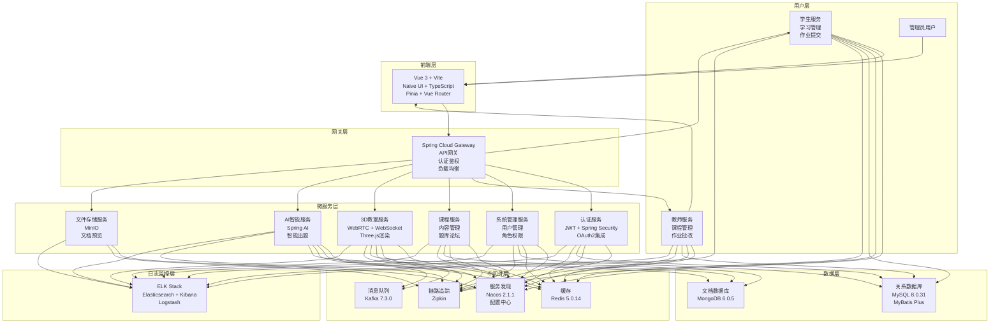

# SapientiaCloud-EduPivot 智语·云枢

## 项目简介

SapientiaCloud-EduPivot（智语·云枢）是一个基于微服务架构的现代化教育平台，采用前后端分离的设计模式，为教育机构提供完整的在线教学解决方案。

## 技术架构

### 系统架构图


```mermaid
graph TB
    %% 用户层
    subgraph "用户层"
        Student[学生用户]
        Teacher[教师用户]
        Admin[管理员用户]
    end

    %% 前端层
    subgraph "前端层"
        UI[Vue 3 + Vite<br/>Naive UI + TypeScript<br/>Pinia + Vue Router]
    end

    %% 网关层
    subgraph "网关层"
        Gateway[Spring Cloud Gateway<br/>API网关<br/>认证鉴权<br/>负载均衡]
    end

    %% 微服务层
    subgraph "微服务层"
        Auth[认证服务<br/>JWT + Spring Security<br/>OAuth2集成]
        System[系统管理服务<br/>用户管理<br/>角色权限]
        Teacher[教师服务<br/>课程管理<br/>作业批改]
        Student[学生服务<br/>学习管理<br/>作业提交]
        Course[课程服务<br/>内容管理<br/>题库论坛]
        Classroom[3D教室服务<br/>WebRTC + WebSocket<br/>Three.js渲染]
        AI[AI智能服务<br/>Spring AI<br/>智能出题]
        MinIO[文件存储服务<br/>MinIO<br/>文档预览]
    end

    %% 中间件层
    subgraph "中间件层"
        Nacos[服务发现<br/>Nacos 2.1.1<br/>配置中心]
        Redis[缓存<br/>Redis 5.0.14]
        Kafka[消息队列<br/>Kafka 7.3.0]
        Zipkin[链路追踪<br/>Zipkin]
    end

    %% 数据层
    subgraph "数据层"
        MySQL[关系数据库<br/>MySQL 8.0.31<br/>MyBatis Plus]
        MongoDB[文档数据库<br/>MongoDB 6.0.5]
    end

    %% 日志监控层
    subgraph "日志监控层"
        ELK[ELK Stack<br/>Elasticsearch + Kibana<br/>Logstash]
    end

    %% 连接关系
    Student --> UI
    Teacher --> UI
    Admin --> UI
    
    UI --> Gateway
    
    Gateway --> Auth
    Gateway --> System
    Gateway --> Teacher
    Gateway --> Student
    Gateway --> Course
    Gateway --> Classroom
    Gateway --> AI
    Gateway --> MinIO
    
    Auth --> Nacos
    System --> Nacos
    Teacher --> Nacos
    Student --> Nacos
    Course --> Nacos
    Classroom --> Nacos
    AI --> Nacos
    MinIO --> Nacos
    
    Auth --> Redis
    System --> Redis
    Teacher --> Redis
    Student --> Redis
    Course --> Redis
    Classroom --> Redis
    AI --> Redis
    
    Classroom --> Kafka
    AI --> Kafka
    
    Auth --> MySQL
    System --> MySQL
    Teacher --> MySQL
    Student --> MySQL
    
    Course --> MongoDB
    Classroom --> MongoDB
    AI --> MongoDB
    
    Auth --> Zipkin
    System --> Zipkin
    Teacher --> Zipkin
    Student --> Zipkin
    Course --> Zipkin
    Classroom --> Zipkin
    AI --> Zipkin
    MinIO --> Zipkin
    
    Auth --> ELK
    System --> ELK
    Teacher --> ELK
    Student --> ELK
    Course --> ELK
    Classroom --> ELK
    AI --> ELK
    MinIO --> ELK
```

### 后端技术栈

- **框架**: Spring Boot 3.2.5
- **微服务**: Spring Cloud 2023.0.1
- **服务发现**: Nacos 2.1.1
- **网关**: Spring Cloud Gateway
- **数据库**: MySQL 8.0.31 + MongoDB 6.0.5
- **缓存**: Redis 5.0.14
- **文件存储**: MinIO
- **消息队列**: Kafka 7.3.0
- **日志收集**: ELK Stack (Elasticsearch 8.10.4 + Kibana 8.10.4 + Logstash 8.10.4)
- **链路追踪**: Zipkin
- **API文档**: Knife4j 4.4.0
- **认证授权**: Spring Security + JWT
- **ORM**: MyBatis Plus 3.5.12
- **连接池**: Druid 1.2.20
- **AI框架**: Spring AI
- **实时通信**: WebSocket + WebRTC

### 前端技术栈

- **框架**: Vue 3.5.17
- **构建工具**: Vite 7.0.4
- **UI组件库**: Naive UI 2.40.1
- **状态管理**: Pinia 3.0.3
- **路由**: Vue Router 4.5.1
- **HTTP客户端**: Axios 1.10.0
- **国际化**: Vue I18n 11.1.11
- **样式**: SCSS + TailwindCSS 4.1.13
- **富文本编辑器**: TipTap 3.6.1
- **图表**: ECharts 6.0.0
- **3D渲染**: Three.js 0.178.0
- **文件预览**: @vue-office系列
- **WebRTC**: 实时音视频通信
- **WebSocket**: 实时消息推送

## 项目结构

### 后端模块

```
SapientiaCloud-EduPivot/
├── SapientiaCloud-EduPivot--auth/          # 认证服务
├── SapientiaCloud-EduPivot--system/        # 系统管理服务
├── SapientiaCloud-EduPivot--gateway/       # API网关服务
├── SapientiaCloud-EduPivot--minIO/         # 文件存储服务
├── SapientiaCloud-EduPivot--teacher/       # 教师服务
├── SapientiaCloud-EduPivot--student/       # 学生服务
├── SapientiaCloud-EduPivot--course/        # 课程服务
├── SapientiaCloud-EduPivot--classroom/     # 3D教室服务
├── SapientiaCloud-EduPivot--ai/           # AI智能服务
├── docker-compose.yaml                      # Docker编排文件
├── init/                                    # 初始化脚本
│   ├── mysql/                              # MySQL初始化脚本
│   ├── mongodb/                            # MongoDB初始化脚本
│   └── nacos-yaml/                         # Nacos配置文件
└── elk/                                    # ELK日志配置
```

### 前端模块

```
SapientiaCloud-EduPivot--ui/
├── src/
│   ├── api/                               # API接口定义
│   ├── components/                        # 公共组件
│   ├── views/                            # 页面组件
│   ├── router/                           # 路由配置
│   ├── store/                           # 状态管理
│   ├── utils/                           # 工具函数
│   ├── types/                           # TypeScript类型定义
│   ├── i18n/                            # 国际化配置
│   └── assets/                           # 静态资源
├── package.json                          # 依赖配置
└── vite.config.ts                       # Vite配置
```

## 核心功能模块

### 1. 认证服务 (auth)

- 用户注册/登录
- JWT令牌管理
- 短信验证码
- 密码重置
- OAuth2集成

### 2. 系统管理服务 (system)

- 用户管理
- 角色权限管理
- 系统配置
- 数据字典
- 操作日志

### 3. 教师服务 (teacher)

- 教师信息管理
- 课程创建与管理
- 作业布置与批改
- 成绩管理
- 教学资源管理

### 4. 学生服务 (student)

- 学生信息管理
- 课程学习
- 作业提交
- 成绩查询
- 学习进度跟踪

### 5. 课程服务 (course)

- 课程内容管理
- 章节管理
- 题库管理
- 论坛讨论
- 任务管理

### 6. 文件存储服务 (minIO)

- 文件上传下载
- 图片处理
- 文档预览
- 存储管理

### 7. 3D教室服务 (classroom)

- 3D虚拟教室环境
- 课堂弹幕系统
- 实时直播功能
- 课堂练习集成
- 课堂签到管理
- AI智能问答
- 章节内容浏览

### 8. AI智能服务 (ai)

- 智能出题系统
- 自动判题功能
- AI问答助手
- 学习内容分析
- 个性化推荐
- 智能评估

### 9. API网关 (gateway)

- 请求路由
- 负载均衡
- 认证鉴权
- 限流熔断
- API文档聚合

## 环境要求

### 开发环境

- JDK 17+
- Maven 3.6+
- Node.js 18+
- Docker & Docker Compose

### 生产环境

- JDK 17+
- MySQL 8.0+
- MongoDB 6.0+
- Redis 5.0+
- MinIO
- Kafka
- Elasticsearch 8.10+

## 访问应用

- 前端应用: http://localhost:5173
- API网关: http://localhost:31600
- Nacos控制台: http://localhost:8848/nacos
- MinIO控制台: http://localhost:31590
- Kibana: http://localhost:5601
- Zipkin: http://localhost:9411

## 服务端口配置

| 服务            | 端口          | 说明        |
|---------------|-------------|-----------|
| Gateway       | 31600       | API网关     |
| Auth          | 31601       | 认证服务      |
| System        | 31602       | 系统管理      |
| MinIO         | 31603       | 文件服务      |
| Teacher       | 31604       | 教师服务      |
| Student       | 31605       | 学生服务      |
| Course        | 31606       | 课程服务      |
| Classroom     | 31607       | 3D教室服务    |
| AI            | 31608       | AI智能服务    |
| MinIO         | 31589/31590 | 文件存储/控制台  |
| MySQL         | 3306        | 数据库       |
| Redis         | 6379        | 缓存        |
| MongoDB       | 27017       | 文档数据库     |
| Nacos         | 8848/9848   | 服务发现/配置中心 |
| Kafka         | 9092/29092  | 消息队列      |
| Elasticsearch | 9200/9300   | 搜索引擎      |
| Kibana        | 5601        | 日志可视化     |
| Zipkin        | 9411        | 链路追踪      |

## 开发指南

### 后端开发

1. 使用Spring Boot 3.2.5 + Spring Cloud 2023.0.1
2. 遵循RESTful API设计规范
3. 使用MyBatis Plus进行数据访问
4. 集成Knife4j生成API文档
5. 使用JWT进行身份认证
6. 集成ELK进行日志收集和分析
7. 使用Spring AI进行智能功能开发
8. 集成WebSocket和WebRTC实现实时通信

### 前端开发

1. 使用Vue 3 Composition API
2. 采用TypeScript进行类型检查
3. 使用Naive UI组件库
4. 集成Pinia进行状态管理
5. 支持国际化（i18n）
6. 使用Vite进行构建和热更新
7. 集成Three.js进行3D渲染
8. 使用WebRTC实现实时音视频通信
9. 集成WebSocket进行实时消息推送

### 数据库设计

- MySQL: 存储结构化数据（用户、课程、系统配置等）
- MongoDB: 存储非结构化数据（课程内容、论坛数据等）

## 核心模块详解

### 3D教室模块 (classroom)

3D教室模块是平台的核心创新功能，提供沉浸式的虚拟教学环境：

#### 技术特性

- **3D渲染引擎**: 基于Three.js构建的虚拟教室环境
- **实时通信**: WebRTC音视频 + WebSocket消息推送
- **UI框架**: 集成Naive UI组件库，提供现代化界面

#### 核心功能

1. **3D虚拟教室环境**
    - 可定制的3D教室场景
    - 支持多用户同时在线
    - 虚拟角色和场景交互

2. **课堂弹幕系统**
    - 实时弹幕消息
    - 表情和互动功能
    - 弹幕过滤和管理

3. **课堂直播功能**
    - 教师端直播推流
    - 学生端观看直播
    - 屏幕共享和互动

4. **课堂练习集成**
    - 与课程模块题库无缝对接
    - 实时练习和答题
    - 即时反馈和统计

5. **课堂签到管理**
    - 多种签到方式（位置、二维码、人脸识别）
    - 签到记录和统计
    - 异常签到处理

6. **AI智能问答**
    - 集成AI模块的问答功能
    - 实时问题解答
    - 学习建议推荐

7. **章节内容浏览**
    - 与课程模块章节数据对接
    - 3D环境下的内容展示
    - 交互式学习体验

### AI智能服务模块 (ai)

AI智能服务模块基于Spring AI框架开发，提供全方位的智能教育功能：

#### 技术特性

- **AI框架**: Spring AI + 大语言模型集成
- **智能算法**: 机器学习 + 自然语言处理
- **数据驱动**: 基于学习数据的智能分析

#### 核心功能

1. **智能出题系统**
    - 基于课程内容自动生成题目
    - 支持多种题型（选择题、填空题、问答题）
    - 难度自适应调整

2. **自动判题功能**
    - 客观题自动判分
    - 主观题智能评分
    - 答题过程分析

3. **AI问答助手**
    - 24/7智能问答服务
    - 课程内容相关问答
    - 学习路径建议

4. **学习内容分析**
    - 学习行为数据分析
    - 知识点掌握度评估
    - 学习效果预测

5. **个性化推荐**
    - 基于学习历史的个性化推荐
    - 学习资源智能匹配
    - 学习计划制定

6. **智能评估**
    - 学习能力评估
    - 知识掌握度评估
    - 学习建议生成

### 生产环境部署

1. 配置生产环境的数据库连接
2. 修改Nacos配置中心的配置
3. 配置SSL证书
4. 设置防火墙规则
5. 配置负载均衡器
6. 设置监控和告警

## 监控和运维

### 日志监控

- 使用ELK Stack收集和分析日志
- 通过Kibana进行日志可视化
- 支持日志搜索和告警

### 链路追踪

- 集成Zipkin进行分布式链路追踪
- 支持请求链路分析和性能监控

### 健康检查

- 各服务集成Spring Boot Actuator
- 提供健康检查端点
- 支持服务状态监控

## 贡献指南

1. Fork项目
2. 创建特性分支 (`git checkout -b feature/AmazingFeature`)
3. 提交更改 (`git commit -m 'Add some AmazingFeature'`)
4. 推送到分支 (`git push origin feature/AmazingFeature`)
5. 创建Pull Request

## 更新日志

### v1.0.0 (2024-01-01)

- 初始版本发布
- 完成基础微服务架构搭建
- 实现用户认证和权限管理
- 完成课程管理核心功能
- 集成文件存储和预览功能
- 完成前端基础框架搭建
- 新增3D虚拟教室模块
- 集成课堂弹幕和直播功能
- 实现课堂练习和签到功能
- 集成AI智能问答系统
- 新增AI智能服务模块
- 实现智能出题和判题功能
- 完善章节内容浏览功能

---

**智语·云枢** - 让教育更智能，让学习更高效！
