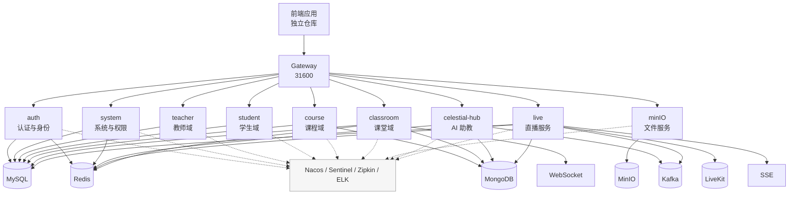

# SapientiaCloud-EduPivot

SapientiaCloud-EduPivot 是一个面向教育场景的微服务平台，围绕认证登录、课程管理、课堂互动、直播教学、文件存储与 AI 助教构建后端能力。

当前仓库是后端主仓库，包含全部微服务、配置中心样例、数据库初始化脚本与 Docker 编排文件；前端源码不在本仓库中。为了方便协作，文档已经拆成总览、前端联调说明、后端开发说明三部分：

- [前端联调说明](./README.frontend.md)
- [后端开发说明](./README.backend.md)

## 仓库定位

- 提供统一网关入口，对外暴露 `/api/**` 接口。
- 采用 Nacos 作为注册中心与配置中心。
- 使用 MySQL、MongoDB、Redis、MinIO、Kafka、LiveKit 等中间件支撑业务。
- 支持课堂座位同步、直播事件订阅、AI 对话与知识向量化等实时/智能化能力。

## 架构总览


```mermaid
graph TD
    UI[前端应用<br/>独立仓库] --> GW[Gateway<br/>31600]

    GW --> AUTH[auth<br/>认证与身份]
    GW --> SYS[system<br/>系统与权限]
    GW --> TEA[teacher<br/>教师域]
    GW --> STU[student<br/>学生域]
    GW --> COURSE[course<br/>课程域]
    GW --> CLASSROOM[classroom<br/>课堂域]
    GW --> FILE[minIO<br/>文件服务]
    GW --> AI[celestial-hub<br/>AI 助教]
    GW --> LIVE[live<br/>直播服务]

    AUTH --> MYSQL[(MySQL)]
    SYS --> MYSQL
    TEA --> MYSQL
    STU --> MYSQL
    COURSE --> MYSQL
    CLASSROOM --> MYSQL
    LIVE --> MYSQL

    COURSE --> MONGO[(MongoDB)]
    CLASSROOM --> MONGO
    AI --> MONGO
    LIVE --> MONGO

    AUTH --> REDIS[(Redis)]
    SYS --> REDIS
    AI --> REDIS
    LIVE --> REDIS
    CLASSROOM --> REDIS

    AI --> KAFKA[(Kafka)]
    LIVE --> KAFKA

    FILE --> MINIO[(MinIO)]
    LIVE --> LIVEKIT[(LiveKit)]
    CLASSROOM --> WS[WebSocket]
    LIVE --> SSE[SSE]
    ALL[Nacos / Sentinel / Zipkin / ELK]:::infra

    AUTH -.-> ALL
    SYS -.-> ALL
    TEA -.-> ALL
    STU -.-> ALL
    COURSE -.-> ALL
    CLASSROOM -.-> ALL
    FILE -.-> ALL
    AI -.-> ALL
    LIVE -.-> ALL

    classDef infra fill:#f6f6f6,stroke:#999,color:#333;
```

## 目录结构

```text
SapientiaCloud-EduPivot/
├── SapientiaCloud-EduPivot--auth/
├── SapientiaCloud-EduPivot--system/
├── SapientiaCloud-EduPivot--gateway/
├── SapientiaCloud-EduPivot--minIO/
├── SapientiaCloud-EduPivot--teacher/
├── SapientiaCloud-EduPivot--student/
├── SapientiaCloud-EduPivot--course/
├── SapientiaCloud-EduPivot--classroom/
├── SapientiaCloud-EduPivot--celestial-hub/
├── SapientiaCloud-EduPivot--live/
├── init/
│   ├── mysql/
│   ├── mongodb/
│   └── nacos-yaml/
├── elk/
├── docker-compose.yaml
└── pom.xml
```

## 核心服务

| 服务 | 端口 | 网关前缀 | 说明 |
| --- | --- | --- | --- |
| gateway | 31600 | `/api/*` | 统一入口、路由、跨域、文档聚合、限流治理 |
| system | 31601 | `/api/system/**` | 用户、角色、权限、通知、仪表盘 |
| auth | 31602 | `/api/auth/**` | 登录注册、JWT、手机号验证码、身份选择、OAuth2 |
| minIO | 31603 | `/api/minIO/**` | 文件上传下载、文件信息、桶管理 |
| teacher | 31604 | `/api/teacher/**` | 教师信息域 |
| student | 31605 | `/api/student/**` | 学生信息、课堂练习提交 |
| course | 31606 | `/api/course/**` | 课程、章节、论坛、题库、任务 |
| classroom | 31607 | `/api/classroom/**` | 教学记录、课堂练习、座位同步、WebSocket |
| celestial-hub | 31608 | `/api/celestial-hub/**` | AI 对话、知识库、文档向量化、AI 出题 |
| live | 31609 | `/api/live/**` | 直播房间、令牌签发、SSE 事件、消息互动 |

## 快速开始

### 1. 环境准备

- JDK 17
- Maven 3.9+
- Docker Desktop / Docker Engine

### 2. 启动中间件

```bash
docker compose up -d
```

默认会拉起 MySQL、Redis、Nacos、Sentinel、MinIO、MongoDB、Kafka、Zipkin、ELK、coturn、LiveKit、egress。

### 3. 初始化数据库

将以下脚本按需导入：

- `init/mysql/nacos.sql` -> `nacos`
- `init/mysql/sapientiacloud_edupivot.sql` -> `sapientiacloud_edupivot`
- `init/mysql/table/*.sql` -> 按模块补充表结构
- `init/mysql/data/sys_permission.sql` -> 权限基础数据

MongoDB 初始化脚本位于 `init/mongodb/`，其中一部分已经通过 `docker-compose.yaml` 挂载到容器启动目录。

### 4. 导入 Nacos 配置

需要将 `init/nacos-yaml/` 下的配置导入到 Nacos：

- `application.yaml`
- `SapientiaCloud-EduPivot--auth.yaml`
- `SapientiaCloud-EduPivot--system.yaml`
- `SapientiaCloud-EduPivot--gateway.yaml`
- `SapientiaCloud-EduPivot--minIO.yaml`
- `SapientiaCloud-EduPivot--teacher.yaml`
- `SapientiaCloud-EduPivot--student.yaml`
- `SapientiaCloud-EduPivot--course.yaml`
- `SapientiaCloud-EduPivot--classroom.yaml`
- `SapientiaCloud-EduPivot--celestial-hub.yaml`
- `SapientiaCloud-EduPivot--live.yaml`

### 5. 编译与启动服务

根目录聚合编译：

```bash
mvn -Dmaven.repo.local=./.m2/repository -DskipTests compile
```

建议启动顺序：

1. Nacos / MySQL / Redis / MongoDB / MinIO / Kafka / LiveKit
2. `auth`、`system`、`teacher`、`student`
3. `course`、`classroom`、`celestial-hub`、`live`
4. `gateway`

## 常用入口

| 组件 | 地址 |
| --- | --- |
| Gateway | `http://localhost:31600` |
| Gateway Knife4j | `http://localhost:31600/doc.html` |
| Nacos | `http://localhost:8848/nacos` |
| Sentinel Dashboard | `http://localhost:8858` |
| MinIO API | `http://localhost:31589` |
| MinIO Console | `http://localhost:31590` |
| Redis Stack UI | `http://localhost:8001` |
| Zipkin | `http://localhost:9411` |
| Kibana | `http://localhost:5601` |
| LiveKit | `http://localhost:7880` |

## 联调约定

- 前端统一访问网关，不直接请求各微服务端口。
- REST 接口统一走 `http://localhost:31600/api/...`。
- 课堂座位同步通过 WebSocket，直播事件通过 SSE，直播音视频通过 LiveKit。
- 具体接入方式见 [前端联调说明](./README.frontend.md)。

## 注意事项

- 当前 `init/nacos-yaml/` 与 `docker-compose.yaml` 中包含示例账号、密码、API Key、主机地址，生产环境必须替换并迁移到安全配置源。
- `gateway` 已放开跨域，便于本地前端独立开发。
- 若只调试单个服务，也请先保证 Nacos 中存在对应 Data ID，否则服务会因缺少配置而无法启动。
